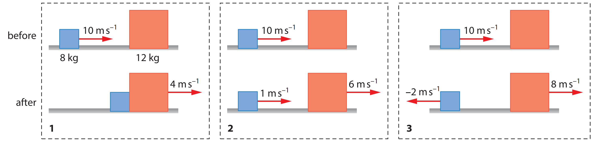

# 
 Game-Physics 

## 
 <u> Boiler Plate </u>

### <u> Position, Displacement, and Average Velocity </u>

One of the main aims behind game development is to simulate the real world characteristics which means we must be able to encapsulate at the least an essence of the real world and everything in it.
Everything in our real world moves from some of the most obvious things such as cars that we see in our day to day life to some not so obvious things such as the smallest particles inside the basic things around us.
Let us first make some assumptions in order to understand the physics and then as we dive deeper into complex physics we will decrease the number of assumptions we make.

* All the motions we talk about take place in one straight line.
* The object that we will be studying will be nothing more than a point like particle.

With these assumptions, let us not understand what position and displacement are.

To locate an object means to find its position relative to some reference point which most of the times is the origin of the cartesian coordinates (0,0). For example a particle at $x = 5m$ means the particle is 5 meters in the positive direction and a particle at x = $-5m$ is 5 meters in the negative direction. As discussed earlier, things move.
We record this movement of a particle by calculating the difference between the initial position and the final position.
We call this value the displacement of the particle (similar to distance but not exactly the same). Displacement is a vector quantity which means it has both direction and a magnitude whereas distance is a scalar quantity which means it is only concerned with the magnitude. The last thing we want to talk about in this section is velocity and average velocity.

Velocity is the rate of change of displacement. In other words, velocity is the quantity that describes how fast do we travel in a particular direction to get from point A to point B.
Average velocity tends to be a more complex topic among whatever we have discussed so far.
Let us understand it with an example.
Lets us say that a particle is currently at its starting point $x = x_{1}$ at time $t_{1} = 0s$ and as time passes, lts say at $t_{2} = 3s$, moves onto increasingly larger positive values of $x$ i.e. $x_{2}$.
For this case, the average velocity would be

$$
v_{avg} = \frac{x_{2}-x_{1}}{t_{2}-t_{1}}
$$

On the other hand average speed is a different way of describing "how fast" a particle moves.

### <u> Acceleration </u>

When a particle's velocity changes, the particle is said to undergo acceleration. For motion along an axis, the average acceleration $a_{avg}$ over a time interval $\Delta t$ is ($\Delta$ means a change).
$$
a_{avg} = \frac{v_{2} - v_{1}}{t_{1} - t_{2}} = \frac{\Delta v}{\Delta t}
$$
One of the most common units of acceleration is $m/s^2$ .This is  yet another vector which means that this has a magnitude and a direction. Just like any other vectors in one direction, its algebraic sign shows its direction. For example if a car with an initial velocity $v = -25m/s$ is brakes to a stop in $5.0 s$ which means that the $a_{avg} = +5.0m/s^2$. The acceleration is positive but the cars speed is decreased. The reason is the difference in signs: the direction of the acceleration is opposite that of the velocity.

### <u> Special case: Constant Acceleration </u>

In many types of motion, acceleration tends to be either constant or approximately so. For example, you might accelerate a car at an approximately constant rate when a traffic light turns from red to green.

These cases of constant acceleration especially in gaming are so common that there are a special set of mathematical equations that can be used based on the situation to find the constant acceleration of a body and we shall list them in their most commonly occurring form with acceleration certainly not being the subject of the equation. I shall also continue to explain all the math in terms of cars because who does not like cars and most of us have at least played one car racing game. The equations are:
$$
v = v_{0}+at
$$
Here $v$ is the final velocity, $v_{0}$ is the initial velocity,$a$ is the acceleration and $t$ is the time taken. The next equation is
$$
x - x_{0} = v_{0}t + \frac{1}{2}at^{2}
$$
Here $x$ is the final position of the car and $x_{0}$ is the initial position. The next equation is
$$
v^{2} = v_{0} + 2as
$$

Another special case here for constant acceleration here is freely falling objects. (For obvious reasons we will not be talking about cars in the examples in this part)

Let us now toss an object up or down in the air on its flight, you shall see that the object accelerates downwards at a certain constant rate. The rate here is called the free fall acceleration and its magnitude is represented by $g$ whose value is $9.81m/s^2.$ Here we assume that there is no air resistance. The interesting part here is that the characteristics of the object such as mass, density or shape, it is the same for all.

The equation that we discussed earlier all work as free fall is still constant acceleration. The only thing different here is that the one dimensional motion that we have been taking so far is along the y-axis instead of the general x-axis. The positive direction of y is upward and negative means downwards. The free fall acceleration is negative-that is, downward on the y-axis towards the Earth's center-and so it has the value $-g$ in the equations.

### <u> Motion in multiple dimensions </u>

So far, we have looked at all the important important concepts in one dimensional. Now we can look at the more complex multi-dimensional problem which is way more interesting and important in game development.

One general way of locating a particle (or particle-like object) is with a position vector $\vec{r}$ which is a vector that extend from a reference point (usually the origin) to the particle.
$$
\vec{r} = x \hat{i} + y \hat{j} + z \hat{l}
$$
where $x \hat{i}, y \hat{j},z \hat{l}$ are the vector components of $\vec{r}$ and the coefficients $x,y,z$ are is scalar components
The coefficients $x,y,z$ are its scalar components. The coefficients $x,y,z$ give the particle's location along the coordinate axes and relative to the origin.

As a particle moves, its position vector changes in such a way that the vector changes in such a way that the particle always extends to the particle from the reference point (the origin). If the position vector changes-say from $\vec{r_{1}}$ to $\vec{r_{2}}$ during a certain time interval- then the particle's displacement $\Delta \vec{r}$ during that time interval is
$$
\Delta \vec{r} = \vec{r_{2}} - \vec{r_{1}}
$$
which we can write as
$$
\Delta \vec{r} = (x_{2} - x_{1})\hat{i}+ (y_{2} - y_{1})\hat{j} +(z_{2} - z_{1})\hat{k}
$$
We don not really need to worry about the math that goes behind the physics as for this class there is basic vector math encompassing python class that will be provided for most of the projects if not all. Hence from now on I will focus more on the physics than diving deeper in the math.

### <u> Average Velocity and Instantaneous Velocity </u>

If a particle moves through a displacement $\Delta \vec{r}$ in a time interval $\Delta t$, then its average velocity $\vec{v}_{avg}$ is

$$
\vec{v}_{avg} = \frac{\Delta \vec{r}}{\Delta t}
$$

This equation also tells us that the direction of average velocity is the same as the change in displacement.

While we have been looking at average velocity, but most of the times when we speak of the velocity of a particle, we usually mean the particle's instantaneous velocity $\vec{v}$ at some instant. This $\vec{v}$ is nothing but $\vec{v}_{avg}$ when $\Delta t$ tends to 0.

### <u> Average Acceleration and Instantaneous acceleration</u>

When a particle's velocity changes from $\vec{v}_{1}$ to $\vec{v}_{2}$ in a time interval $\Delta t$ its average acceleration is
$$
\vec{a}_{avg} = \frac{\vec{v}_{2} - \vec{v}_{1}}{\Delta t} = \frac{\Delta \vec{v}}{\Delta t}.
$$
JUst like we did for instantaneous velocity here as well This instantaneous acceleration $\vec{a}$ is nothing but $\vec{a}_{avg}$ when $\Delta t$ tends to 0.

## 
 <u> Projectile Motion </u> 

So far everything we have spoken about can be referred as the boiler plate, (basic definitions,jargons, notation, etc).
I will mark all boiler plate sections and sub sections going forward.
These will tend to be denser and much tougher in terms of conceptual physics understanding but at the same time it will be very important to understand the concepts and the math behind it as it will be used in the projects in this class.
We shall now move onto something that is more directly relatable to games such as a projectile.

What is a projectile?

A projectile is generally an object propelled through a fluid, (air is technically a fluid) or vacuum. Projectile motion is a special case of two-dimensional motion: A particle moves in a vertical plane with some initial velocity $\vec{v}_{0}$ but its acceleration is always the free-fall acceleration $\vec{g}$ which is downward. Some of the few very common examples of projectiles that we come across in games are when are playing a game in which shooting is involved. In this case, the bullet that we shoot or the rocket that we launch on our opponent is an example of a projectile and its motion is called the projectile motion. In order to create real world like projectiles in our games, let us analyze and understand real world projectiles and the physics behind them so we can then create them accurately in the game.

As usual we will first start with some assumptions to get the basics correct and then we will move to the tougher parts.

Assumption:

* Let us assume that air has no effect i.e. no air resistance.

Let us now look at another example, a surface to surface missile is launched in GTA V with an initial velocity $v_{0}$ which can be written as

$$
v_{0} = v_{0x}\hat{i} + v_{0y}\hat{j}
$$

The components $v_{0x}$ and $v_{0y}$ can then be found if we know the angle $\theta_{0}$ between $\vec{v}_{0}$ and the surface from which the missile was fired which is also the positive x direction.

$ v_{0x} = v_{0}\cos{\theta_{0}} $ and $v_{0x} = v_{0}\sin{\theta_{0}} $

During the missiles two-dimensional motion, its position vector $\vec{r}$ and velocity vector $\vec{v}$ change continuously, but its acceleration vector $\vec{a}$ is constant and always directed vertically downward. The missile has no horizontal acceleration.
In projectile motion, the horizontal motion and the vertical motion are independent of each other; that is, neither motion affects the other. Hence now we can further simplify the motion of this missile into independent horizontal and vertical motion making it essentially 2 one dimensional problems.

### <u> Horizontal Motion </u>

The horizontal motion of the missile is a one-dimensional motion with constant acceleration $\vec{a}_{x} = 0$ and constant velocity $\vec{v}_{x} = v_{0x}$. The horizontal position of the missile at time $t$ is then given by
$$
x - x_{0} = v_{0x}t
$$
where $x_{0}$ is the initial horizontal position of the missile.
Because the value of $v_{0x}$ will become $v_{0} \cos {\theta_{0}}$, we can write the horizontal position of the missile at time $t$ as
$$
x - x_{0} =( v_{0}\cos{\theta_{0}})t
$$

### <u> Vertical Motion </u>

The vertical motion of the missile is also a one-dimensional motion with constant acceleration $\vec{a}_{y} = -g$ and constant velocity $\vec{v}_{y} = v_{0y}$. The vertical position of the missile at time $t$ is then given by
$$
y - y_{0} = v_{0y}t - \frac{1}{2}gt^{2}
$$
where $y_{0}$ is the initial vertical position of the missile.
Because the value of $v_{0y}$ will become $v_{0} \sin {\theta_{0}}$, we can write the vertical position of the missile at time $t$ as
$$
y - y_{0} = (v_{0}\sin{\theta_{0}})t - \frac{1}{2}gt^{2}
$$

Now that we have derived the equations of vertical and horizontal motion independent of each other, we can now lose the time dependence in both and we can write the equation of the path of the missile as

$$
y = \tan{\theta_{0}}x - \frac{1}{2}\frac{g}{(v_{0}\cos{\theta_{0}})^{2}}x^{2}
$$

### <u> The Horizontal Range </u>

The horizontal range of the missile is the distance between the initial and final horizontal positions of the missile. The horizontal range is given by
$$
R = x - x_{0} = \frac{v_{0}^{2}}{g}\sin{2\theta_{0}}
$$
This equation does not give the horizontal distance traveled by a projectile when the final height is not the launch height.

NOTE: The horizontal range R is maximum for a launch angle of $\theta_{0} = 45^{\circ}$. Although in the game or in real life the missile even if launched in a 45 degree angle will not travel the maximum horizontal distance, it will travel a distance less than the maximum horizontal distance due to the air resistance.

## <u> Newton's Laws of Motion </u>

### <u> Newton's First Law </u>

Before Newton formulated his mechanics, it was thought that some influence, a “force,” was needed to keep a body moving at constant velocity.
Similarly, a body was thought to be in its “natural state” when it was at rest.
For a body to move with constant velocity, it seemingly had to be propelled in some way, by
a push or a pull.
Otherwise, it would “naturally” stop moving.

#### <u> Force </u>

Before we talk about Newton's laws of motion, let us first talk about force. We can define the unit of force in terms of the acceleration a force would
give to the standard kilogram  which has a mass defined to be exactly
$1 kg$. Suppose we put that body on a horizontal, frictionless surface and pull horizontally such that the body has an acceleration of $1 m/s^2$ then we can define our applied force as having a magnitude of 1 newton (abbreviated N). The SI unit of force is Newton(N). The force is a vector quantity because it has both magnitude and direction. The SI unit of force is Newton(N).

<u>Newton's first law of motion states that a body will remain at rest or in uniform motion in a straight line unless acted upon by an external force.</u>

Newton’s first law is not true in all reference frames, but we can always find reference frames in which it (as well as the rest of Newtonian mechanics) is true.
Such special frames are referred to as inertial reference frames, or simply inertial
frames.

### <u> Newton's Second Law </u>

Newtons second law can be summarized in one neat statement which is

<u>The net force on a body is equal to the product of the body’s mass and its acceleration.</u>

Which in equation form is

$$
\vec{F}_{net} = m\vec{a}
$$

Newton's second law in equation from tells us that if the net force on a body is zero, the body’s acceleration $\vec{a} = 0$. If the body is at rest, it stays at rest; if it is moving, it continues to move at constant velocity.
In such cases, any forces on the body balance one another, and both the forces and the body are said to be in equilibrium.
Commonly, the forces are also said to cancel one another, but the term “cancel” is tricky.
It does not mean that the forces cease to exist (canceling forces is not like canceling dinner reservations).
The forces still act on the body but cannot change the velocity.

### <u> Newton's Third Law </u>

#### <u> Interesting Forces (Boiler plate) </u>

* <u> Gravity </u>: A gravitational force $\vec{F}_{g}$ on a body is a certain type of pull that is directed toward a second body.
For the entirety of this document, we do not discuss the nature of this force and usually consider situations in which the second body is Earth.
Thus, when we speak of the gravitational force $\vec{F}_{g}$ on a body, we mean  a force that pulls on it directly toward the center of Earth—that is, directly down toward the ground.
We shall assume that the ground is an inertial frame.
* <u> Weight </u>: The weight of a body is the gravitational force $\vec{F}_{g}$ on it.
* <u> Normal Force </u>: The normal force $\vec{F}_{n}$ on a body is a force that is perpendicular to the surface of the body and that is directed away from the surface.
* <u> Friction </u>: The frictional force $\vec{F}_{f}$ on a body is a force that is parallel to the surface of the body and that is directed away from the surface.
* <u> Tension </u>: The tension $\vec{F}_{t}$ in a string or rope is a force that is parallel to the string or rope and that is directed away from the string or rope.

Two bodies are said to interact when they push or pull on each other—that is,
when a force acts on each body due to the other body.
The force that one body exerts on another is called the action force, and the force that the other body exerts on the first body is called the reaction force.
The action and reaction forces are equal in magnitude and opposite in direction.
The action and reaction forces are said to act on different bodies, but they are said to act on the same point.

<u> Newtons Third law states that When two bodies interact, the forces on the bodies from
each other are always equal in magnitude and opposite in direction.</u>

## <u> Center of Mass </u>

Here is a quick example. If you toss a ball into the air without much spin on the
ball its motion is simple—it follows a parabolic path, as we discussed earlier and the ball can be treated as a particle.
If, instead, you flip a baseball bat into the air its motion is more complicated.
Because every part of the bat moves differently, along paths of many different shapes, you cannot represent the bat as a particle.
Instead, it is a system of particles each of which follows its own path through the air.
However, the bat has one special point—the center of mass—that does move in a simple parabolic path.
The other parts of the bat move around the center of mass.

We define the center of mass (com) of a system of particles (such as a person) in order to predict the possible motion of the system.

We start with a system of only a few particles, and then we consider a system of a great many particles (a solid body, such as a baseball bat).

### <u> Center of Mass of a System of a Few Particles (Two Particles)</u>

Let us consider a system of two particles, each of mass $m_{1}$ and $m_{2}$, respectively, and located at positions $\vec{r}_{1}$ and $\vec{r}_{2}$, respectively. The center of mass of this system is the point $\vec{r}_{com}$, where the total mass of the system is concentrated. The position of the center of mass is given by

$$
\vec{r}_{com} = \frac{m_{1}\vec{r}_{1} + m_{2}\vec{r}_{2}}{m_{1} + m_{2}}
$$

### <u> Center of Mass of a System of a Few Particles (Many Particles)</u>

Let us consider a system of $N$ particles, each of mass $m_{i}$ and located at position $\vec{r}_{i}$, where $i = 1, 2, \dots, N$. The center of mass of this system is the point $\vec{r}_{com}$, where the total mass of the system is concentrated. The position of the center of mass is given by

$$
\vec{r}_{com} = \frac{\sum_{i=1}^{N}m_{i}\vec{r}_{i}}{\sum_{i=1}^{N}m_{i}}
$$

By extension of this we can now write the same formula individually for all 3 dimensions

$$
x_{com} = \frac{\sum_{i=1}^{N}m_{i}x_{i}}{\sum_{i=1}^{N}m_{i}}
$$
$$
y_{com} = \frac{\sum_{i=1}^{N}m_{i}y_{i}}{\sum_{i=1}^{N}m_{i}}
$$
$$
z_{com} = \frac{\sum_{i=1}^{N}m_{i}z_{i}}{\sum_{i=1}^{N}m_{i}}
$$
We can also define the center of mass with the language of vectors.
First recall that the position of a particle at coordinates $(x, y, z)$ is given by the vector $\vec{r} = (x, y, z)$.
The center of mass of a system of particles is the position of the point where the total mass of the system is concentrated.
The position of the center of mass is given by the vector $\vec{r}_{com} = (x_{com}, y_{com}, z_{com})$.

## <u> Momentum </u>

Now that we have defined the center of mass of a system of particles, let us start by understanding Newton's second law in terms of the center of mass for a system of particles.

A good example for this section for this section that I will be using quite often would be the game 8-ball pool or just pool in general.

If you roll a cue ball at a second billiard ball that is at rest, you expect that the two-ball system will continue to have some forward motion after impact.
You would be surprised, for example, if both balls came back toward you or if both moved to the right or to the left.
You already have an intuitive sense that something continues to move forward.
What continues to move forward, its steady motion completely unaffected by the collision, is the center of mass of the two-ball system.
If you focus on this point—which is always halfway between these bodies because they have identical masses—you can easily convince yourself by trial at a billiard table or virtually on 8-ball pool that this is so.
No matter whether the collision is glancing, head-on, or somewhere in between, the center of mass continues to move forward, as if the collision had never occurred.
Let us look into this center-of-mass motion in more detail.

To do so, we replace the pair of billiard balls with a system of n particles of (possibly) different masses.
We are interested not in the individual motions of these particles but only in the motion of the center of mass of the system.
Although the center of mass is just a point, it moves like a particle whose mass is equal to the total mass of the system; we can assign a position, a velocity, and an acceleration to it.
We state (and shall prove next) that the vector equation that governs the motion of the center of mass of such a system of particles is
$$
\vec{F}_{net} = m_{com}\vec{a}_{com}
$$
This equation is Newton’s second law for the motion of the center of mass of a system of particles.
Note that its form is the same as the form of the equation
$$
\vec{F}_{net} = m\vec{a}
$$
for the motion of a single particle, except that the mass $m$ is replaced by the mass of the center of mass $m_{com}$.
We must carefully evaluate each quantity in the com equation.

* The net force on the center of mass is the sum of the forces on the center of mass due to each particle in the system.
* The mass of the center of mass is the sum of the masses of all the particles in the system.
* The acceleration of the center of mass is the sum of the accelerations of all the particles in the system.
* This equation can be broken down into its respective components for each dimension as
$$
F_{x, net} = m_{com}a_{x, com}
$$
$$
F_{y, net} = m_{com}a_{y, com}
$$
$$
F_{z, net} = m_{com}a_{z, com}
$$
When the two balls collide, the forces that come into play are internal forces, on one ball from the other.
Such forces do not contribute to the net force $\vec{F}_{net}$ which remains 0 as $\vec{a}_{com} = 0$.
Thus, the center of mass of the system, which was moving forward before the collision, must continue to move forward after the collision, with the same speed and in the same direction.

The equations we have derived so far in this section including the center of mass equation can be applied to any system of particles.

## <u> Linear Momentum </u>

Just like always, I will start with a much simpler example to understand the concept of linear momentum.
I will only talk about a single particle first instead of a system of particles, in order to define two important quantities.
We shall then extend those definitions to systems of many particles.

The linear momentum of a particle is a vector quantity and is defined as:

$$
\vec{p} = m\vec{v}
$$

where $m$ is the mass of the particle and $\vec{v}$ is the velocity of the particle. The the SI unit for momentum is the kilogram-meter per second $kg\cdot m/s$.

Newton originally defined his second law in terms of the momentum of a particle.
He wrote that the time rate of change of the momentum of a particle is equal to the net force acting on the particle and is in the direction of that force.

Now that we have defined linear momentum for a single particle, let us extend this definition to a system of particles.

Consider a system of n particles, each with its own mass, velocity, and linear momentum.
The particles may interact with each other, and external forces may act on them.
The system as a whole has a total linear momentum $\vec{P}$. The total linear momentum of the system is the vector sum of the linear momenta of the individual particles. Thus,
$$
\vec{P} = \sum_{i=1}^{N}\vec{p}_{i}
= \sum_{i=1}^{N}m_{i}\vec{v}_{i}
$$

Now that we have defined linear momentum for a system of particles, let us look specifically at collisions and impulse.

## <u> Collisions</u>

A collision is an interaction between two or more objects in which they exchange momentum.
The collision of two billiard balls is a good example here.
The collision of a billiard ball with a wall is another example.
The collision of a billiard ball with a cue stick is yet another example.
In all these cases, the billiard balls exchange momentum with the wall or with the cue stick or with another wall.

### Types of Collisions

Mainly there are two types of collisions:

* Elastic Collisions
* Inelastic Collisions

The collisions we have spoken about in this section so far are all elastic collisions, meaning that the total kinetic energy of the system is conserved.
The total kinetic energy of the system is the sum of the kinetic energies of the individual particles.
The total kinetic energy of the system is conserved because the total linear momentum of the system is conserved.
The total linear momentum of the system is the sum of the linear momenta of the individual particles.
The total linear momentum of the system is conserved because the total force on the system is conserved.
The total force on the system is conserved because the total mass of the system is conserved.
The total mass of the system is conserved because the total number of particles in the system does not change.

$$
F_{net} = \frac{\Delta p}{\Delta t}
$$

So basically, elastic collisions are collisions in which no energy is lost to heat or sound or in any other possible way.

This law of conservation can be mathematically written by the equation:

$$
\frac{\Delta p}{\Delta t} = 0
$$

where $\Delta p$ is the change in momentum and $\Delta t$ is the change in time which in terms of mass and velocity are:

$$
\Delta p = m_{1}\vec{v}_{1} - m_{2}\vec{v}_{2}
$$
$$
\Delta t = \frac{m_{1}\vec{v}_{1} - m_{2}\vec{v}_{2}}{m_{1}\vec{v}_{1} + m_{2}\vec{v}_{2}}
$$

In the real world, there are no perfectly elastic collisions on an everyday scale of size. But you can get the sense of an elastic collision by imagining a perfect pool ball which doesn't waste any energy when it collides.
In an elastic collision, both kinetic energy and momentum are conserved (the total before and after the collision remains the same). Let us now consider examples of inelastic collisions given in the picture below.

I do not think I need to convince you here that in all the three cases, the total linear momentum of the system is conserved.
The incoming body has mass 8.0 kg and the other a mass of 12 kg.
Let us examine these collisions from the point of view of energy.
In all cases the total kinetic energy before the collision is:

$$
E_{kinetic} = \frac{1}{2}8 \cdot 10^2 = 400J
$$
The total kinetic energy after the collision for each case is

* Case 1: $ E_{kinetic} = \frac{1}{2}20 \cdot 4^2 = 160J$
* Case 2: $ E_{kinetic} = \frac{1}{2}8 + \frac{1}{2} 12 \cdot 6^2 = 220J$
* Case 3: $E_{kinetic} = \frac{1}{2}8 \cdot 2^2 +  \frac{1}{2} 12 \cdot 8^2 = 400J$

We thus observe that whereas momentum is conserved in all cases,
kinetic energy is not. Kinetic energy is conserved only in the third case, i.e. that is the only case in which the collision is elastic.
In an inelastic collision, kinetic energy is lost. When the bodies stick together after a collision (case 1), the collision is said to be totally inelastic (or plastic), and in this case the maximum possible kinetic energy is lost.
